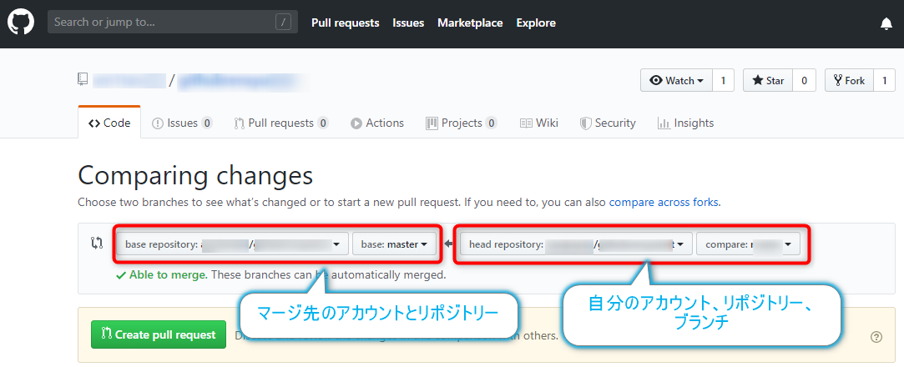

# github-prac2019
2019年度GitHubの練習用リポジトリー

- [方針](https://github.com/tanakaedu/github-prac2019/blob/master/README.md#%E6%96%B9%E9%87%9D)
- [最初の準備](https://github.com/tanakaedu/github-prac2019/blob/master/README.md#%E6%9C%80%E5%88%9D%E3%81%AE%E6%BA%96%E5%82%99)
- [作業時の約束事](https://github.com/tanakaedu/github-prac2019/blob/master/README.md#%E4%BD%9C%E6%A5%AD%E6%99%82%E3%81%AE%E7%B4%84%E6%9D%9F%E4%BA%8B)
- [自分が行った変更点をマスターに統合する](https://github.com/tanakaedu/github-prac2019/blob/master/README.md#%E8%87%AA%E5%88%86%E3%81%8C%E8%A1%8C%E3%81%A3%E3%81%9F%E5%A4%89%E6%9B%B4%E7%82%B9%E3%82%92%E3%83%9E%E3%82%B9%E3%82%BF%E3%83%BC%E3%81%AB%E7%B5%B1%E5%90%88%E3%81%99%E3%82%8B)
- [最新の状態に更新する](https://github.com/tanakaedu/github-prac2019/blob/master/README.md#%E6%9C%80%E6%96%B0%E3%81%AE%E7%8A%B6%E6%85%8B%E3%81%AB%E6%9B%B4%E6%96%B0%E3%81%99%E3%82%8B)
- [リソースの管理]()


# 方針
- ソースコードのみをGitHubで管理
- アセットやリソースは、`.gitignore`に設定して管理しない
- アセットやリソースは、ネットドライブ上の指定のフォルダーに配置して、`robocopy`でやり取りする
  - https://www.atmarkit.co.jp/ait/articles/0704/20/news130.html
  
# 最初の準備
- 自分のアカウントでGitHubにサインインする
- このリポジトリー https://github.com/tanakaedu/github-prac2019 を開いて、自分のアカウントにFork(フォーク)する
  - **フォーク**・・・他のアカウントのGitHubリポジトリーを、自分のアカウントにコピーすること
  - 自分のアカウントにフォークしたリポジトリーは、フォーク元のリポジトリーには影響を与えずに、自由に変更することができる
- GitHub Desktopで、フォークしたリポジトリーをクローンする
  - **クローン**・・・作業しているPCにリポジトリーをダウンロードすること

最新のデータを取得できるようにするために、フォーク元のリポジトリーを追加する。

- GitHub Desktopの*Repository*メニューから、*Open in Command Prompt*を選択
- 以下を入力して、現在登録されているリポジトリーを確認しておく

```
git remote -v
```

*origin*という名前で、自分のアカウントのリポジトリーが*fetch*と*push*の双方で表示される。

- 以下のようなコマンドを実行する。正式な内容は講義内で示す

```
git remote add upstream https://github.com/フォーク元のアカウント名/リポジトリー名.git
```

以上を実行したら、`git remote -v`を改めて実行する。*upstream*が登録されていることが確認できる。

これで、*origin*を指定したらフォークした自分のGitHubアカウントへのアクセスになり、*upstream*を指定したら、フォーク元のリポジトリーへのアクセスというように切り替えられるようになる。ただし、この操作はコマンドのみ対応なので、今回と同様にコマンドプロンプトで操作する。

# 作業時の約束事
- masterブランチでは作業せず、作業用ブランチを作成して、そこで作業する。これにより、不具合が発生した時にいつでもmasterに戻すことができる
- シーンやプレハブは、担当者以外は変更しないこと
  - シーンに試しに配置をする場合は、元のシーンを[Ctrl]+[D]キーで複製するなどして、そこで作業を行う
  - プレハブの変更が必要な場合は、担当者に作業をお願いするか、許可を取って、最新版を取得してから作業をして、完了したら速やかに元に反映させる
- 1つ作業をしたらコミットする。コミットのSummaryに変更点を1つだけ書くのがよい


# 自分が行った変更点をマスターに統合する
プルリクエストを作成して、担当者にマージを実施してもらう。

- GitHub Desktopなどで、変更点を全てコミットして、*Changes*が`0 changed files`であることを確認する
- Pushして、自分のGitHubアカウントにアップロードする
- GitHub Desktopの*Repository*メニューから*View on GitHub*を選択します
- Webブラウザーが開いて、GitHubページが開いたら、リポジトリー名のすぐ下に並んでいる項目から*Pull requests*をクリックする
- *New Pull Requests*ボタンをクリック
- 以下のように、フォーム元のアカウントのリポジトリーのmasterブランチへのプルリクエストが示される。右の方の自分のアカウントのブランチを作業したものに設定したら、*Create pull request*ボタンをクリックする



あとは、管理者側でマージを実施する。コンフリクトが発生した場合は、相談の上、コンフリクトを解消する。

# 最新の状態に更新する
マージが完了して、新しい内容を自分の作業用リポジトリーに持ってきたい場合の手順を示す。

- GitHub Desktopに切り替える
- Commitをして、*Changes*にファイルがない状態にしておく
- *Fetch origin*ボタンをクリックして、upstreamの更新を取得する
- *Current branch*ボタンをクリックして、一番下の*Choose a branch to merge into master*をクリックして、*upstream/master*を選択して、マージを実行する

以上で、自動的にマージができるならマージが実行される。失敗した場合は、*Open in Atom*で一つずつ開いて、衝突を確認しながら解消していく。

古い作業用ブランチは削除して、新しいブランチで作業するとすっきりと作業ができる。

# リソースの管理
学内のネットドライブで管理して、GitHubにはアップしない。リポジトリー内に更新用のバッチファイルを用意しておくので、リソースの変更があったらそれを実行して、最新のデータを取ってくるようにする。

## 参考
- [atmarkIT. Windowsの「robocopy」コマンドでフォルダをバックアップ／同期させる](https://www.atmarkit.co.jp/ait/articles/0704/20/news130.html)


